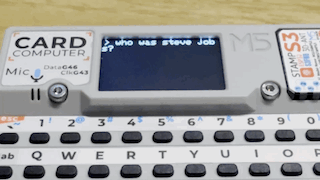

# **CardputerGPT - M5Stack Cardputer ChatGPT Interface**

This is an open-source project that transforms your M5Stack Cardputer into an interactive AI assistant powered by OpenAI's GPT models. The interface supports multi-turn conversations, typed assistant responses, scrolling, and dynamic user interaction.



## **Features**
- **GPT Integration**: Supports multi-turn conversations using OpenAI’s GPT-3.5/4.
- **Typed Assistant Responses**: Displays assistant messages character-by-character for a dynamic experience.
- **User Interaction**: 
  - Green text for user input
  - White text for assistant responses
- **Scrolling**: Navigate long messages with `'` (up) and `/` (down).
- **Customizable**: Easily adjust line height, text size, and API parameters.

## **Requirements**
- **Hardware**: 
  - M5Stack Cardputer (or compatible device)
- **Software**:
  - Arduino IDE
  - M5Stack library
  - OpenAI API Key

## **Getting Started**

### **1. Clone the Repository**
```bash
git clone https://github.com/shaahin/CardputerGPT
cd CardputerGPT
```

### **2. Configure API and WiFi**
- Copy `config.h.sample` to `config.h`:
  ```bash
  cp config.h.sample config.h
  ```
- Edit `config.h` to add your WiFi credentials and OpenAI API key:
  ```cpp
  static const char ssid[] PROGMEM = "YourWifiSSID";
  static const char password[] PROGMEM = "YourWifiPassword";
  static const char openaiKey[] PROGMEM = "YourOpenAIKey";
  ```

### **3. Install Dependencies**
- Open Arduino IDE and install the following libraries:
  1. **M5Stack** (via Library Manager)
  2. **ArduinoJson** (via Library Manager)

### **4. Upload to Your Device**
- Connect your Cardputer via USB.
- Open `CardputerGPT.ino` in the Arduino IDE.
- Select the correct port and board.
- Click **Upload**.

---

## **Usage**
1. On startup, the Cardputer displays a greeting and connects to WiFi.
2. Begin typing your query. Your input will appear with a `> ` prefix.
3. Press **Enter** to send your query to OpenAI.
4. The assistant will display its response typed character by character.
5. Use `'` and `/` to scroll through long responses. (Still have issues 🫠)

---

## **Customization**

### **Line Height**
Adjust the line height to change spacing between lines:
```cpp
chatUI.setLineHeight(32); // Default is 24
```

### **Text Size**
Set the text size for all messages:
```cpp
canvas.setTextSize(2); // Default size
```

### **Assistant Behavior**
Edit the system prompt in `OpenAI.cpp` to customize how the assistant responds:
```cpp
static const char systemPrompt[] PROGMEM = "You are a helpful assistant.";
```

---

## **License**
This project is licensed under the **GPL-3.0 License**.

---

## **Support**
For questions or issues, please open an [issue](https://github.com/shaahin/CardputerGPT/issues) on GitHub. Also feel free to contribute!

Happy building! 🚀